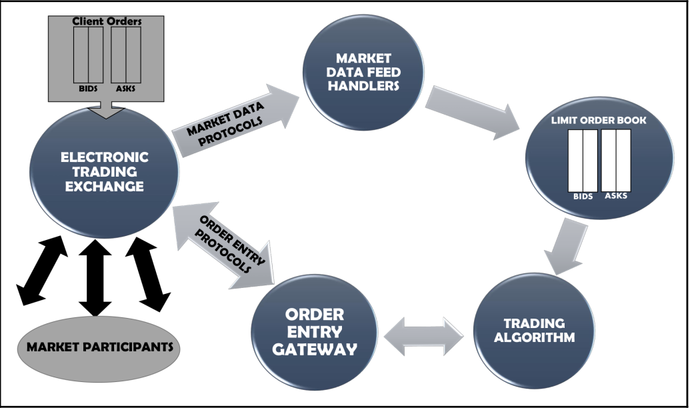

# بخش اول

## Market Sectors

بخش‌های بازار انواع مختلفی از کالاهای اساسی هستند که قابل معامله هستند.

## Asset Classes

 کلاس دارایی انواع مختلفی از وسایل/ابزارهای واقعی است که برای تبادل‌های مختلف در دسترس است.
 
 دو تا معروف‌ترین‌های آن‌ها `options` و `future` هستند.

  ۱. **future**: قراردادی است که بین خریدار و فروشنده بسته می‌شود و در آن تضمین می‌شود تا یک تاریخ مشخص خریدار، یک مقدار مشخص از کالای تهیه شده توسط خریدار را با قیمت تعیین شده خریداری کند.

۲. **options**: همان future است با این تفاوت که خریدار یا فروشنده می‌توانند قرارداد را لغو کنند. برای این‌که طرفین ضرر زیادی نبینند یک مقدار حداقلی از پول به نام `premium` را در نظر می‌گیرند. (حداقل پولی که برای قرارداد options در نظر گرفته می‌شود.)

## Exchange Order Book

همه‌ی درخواست‌های خرید و فروش کاربر در این قسمت نگهداری می‌شود. اطلاعات آن شامل قیمت، تعداد  سهم، نوع سفارش و اطلاعات خریدار است.

## انواع سفارش

1. IOC (Immediate or Close): 

2. GTD (Good Till Day):

3. Stop orders:

## مدیریت سود و ضرر

به مدیریت سود و ضرر `PnL` یا `Profit and Loss Management` می‌گویند.

۱. به اجرا کردن سفارش خرید، داشتن `long position` می‌گویند. 

۲. به اجرا کردن سفارش فروش، داشتن `short position` می‌گویند.

**نکته:** Long positionها  زمانی  به سود می‌رسند که قیمت بازار بالاتر از قیمت `postion` باشد. یا به عبارت دیگر تابع $f$ مثبت باشد.

**نکته:** در الگوریتم‌های trading منظور از positions تعدادهای محدود معامله هست؛ زیرا با مدام در حال معامله نیستیم.

$$f(x) = market\: price - position\: price$$

**نکته:** سودهای تحقق نیافته به `long position`هایی می‌گویند که قیمت بازار بالاتر از قیمت postition است اما ما چون سود را نفروخته‌ایم، آن را به عنوان تحقق نیافته در نظر می‌گیریم. (سود بالقوه). در واقع:

$$PnL = \Sigma_{s}^{Stocks} (realized\: PnL + unrealized\: PnL) $$

## Trend Following Strategy

## Mean Reversion Strategy

## Backtesting

Backtesting یک مرحله‌ی مهم برای به دست آوردن آماری است که نشان می‌دهد چقدر استراتژی trading کارآمد است.

# بخش دوم

## Trend Indicator

مطالعه‌ بر روی داده‌های تاریخچه‌ی قیمت‌ها باعث می‌شود که اگر قیمت‌ها برای چند روز ثابت در حال افزایش بودند، یک long position جدید ایجاد کنیم. 

## Momentum Indicator

مطالعه روی قدرت رفتار‌های گذشته است. (درست نفهمیدم)

 ## تفاوت Trend و Momentum

## Support and Resistance Indicator

**Support line:**
وقتی قیمت‌ها در حال کاهش/ریزش هستند، انتظار داریم در نقطه‌ای این ریزش (به‌خاطر تقاضا) متوقف شود که به آن خط حمایت یا support line گفته می‌شود.

**Resistance line:**
 وقتی قیمت‌ها در حال افزایش هستند، ما به دلیل عرضه‌ی کالاها انتظار داریم تا در نقطه‌ای این روند متوقف شود که به آن خط مقاومت یا resistance line می‌گویند.

## روش‌های رایج در تحلیل تکنیکال

1. Simple Moving Average (SMA)
2. Exponential Moving Average (EMA)
3. Absolute Price Oscillator (APO)
4. Moving Average Convergence Divergence (MACD)
5. Bollinger Bands (BBANDS)
6. Relative Strength Indicator (RSI)
7. Standard Deviation (STDEV)
8. Momentum (MOM)

# کلمات مهم

| کلمه | معنی| 
| ------------- |:-------------:|
| promissory notes | سفته |
| bonds | اوراق قرضه |
| supply | عرضه |
| demand | تقاضا |
| profit | سود |
| market | بازار |
| commodity | کالا |
| ephermal |  زود گذر، کم‌دوام | 
| inherent | ذاتی |
| equilibrium‌ |‌ تعادل |
| intuitively |‌ به‌طور شهودی، بصری | 
| retail business | تجارت خرده‌فروشی | 
| asset | دارایی |
| underlying products | کالاهای اساسی | 
| equities | سهام |  
| bid (buy order) | سفارش خرید (پیشنهاد) | 
| ask (sell order) | سفارش فروش | 
| broker | دلال |
| capital | سرمایه | 
| for the sake of | به‌خاطرِِِِِِِ | 
| bankruptcy | ورشکستگی | 
| amend | اصلاح کردن |
| momentum | تکانه | 
| indicator | شاخص، اندیکاتور |

